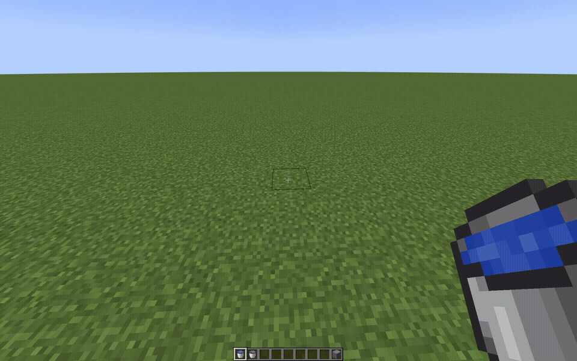
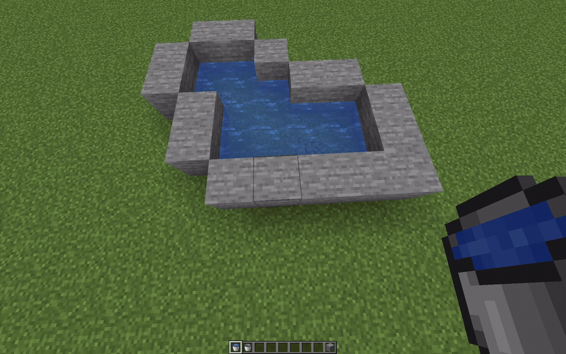
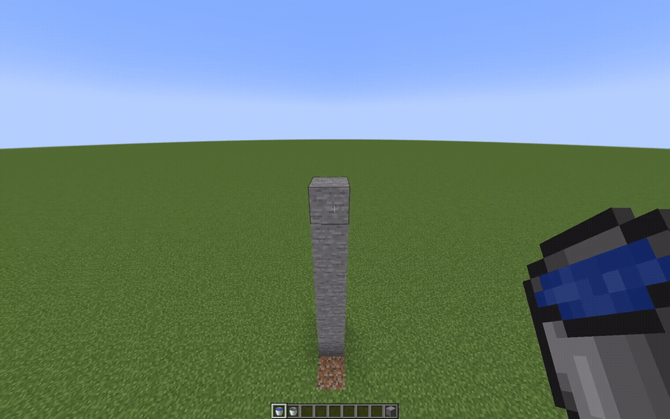
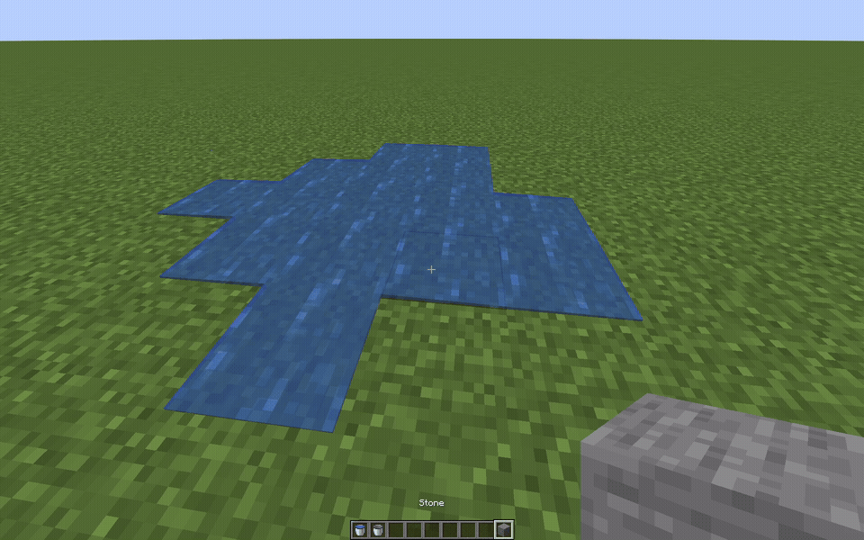
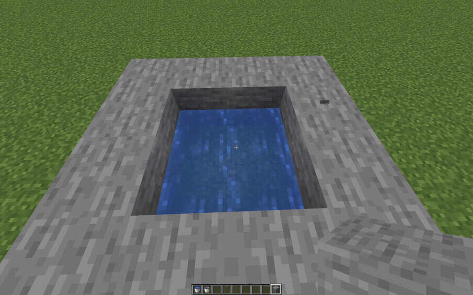

# Gradient
**A region-based fluid simulation overhaul for Minecraft (Fabric 1.20.1).**  
Gradient replaces the basic vanilla Minecraft water physics with a more realistic and discrete water distribution system.

---

## Demo






---

## Features
- Conservation: water levels are conserved when transferred between pools and cannot achieve infinity
- Multi-level water: fluid height is treated as a discrete level rather than source blocks
- Region-based simulation: water state is stored and updated in discrete regions for performance and locality
- Lazy assimilation: vanilla water converts into simulated water only when interacted with
- Adjustable tick rates: adjust sim step interval and world sync interval for different hardware/server TPS targets
- Configurable fluid options: (Soon)
- Full mod compatibility: (Soon)

---

## Outline
1. **Spatial partitioning**
- The world is partitioned into fixed size 3D regions 
- Each region stores its own fluid state and a small amount of metadata

2. **Fluid state representation**
- Tracks a level/amount per cell
- Each simulated cell stores water level/amount as well as pending deltas

3. **Activation/Lazy simulation**
- Regions are only simulated when active
- A region becomes active when a player interacts with it, or a block update occurs that implies water response
- When activation happens, nearby vanilla water can be assimilated into the sim

4. **Simulation**
- Every `k` ticks, the simulation advances for every activated region
- Each update computes transfers between cells and applies the results
- Water is necessarily conserved across simulation steps

---

## Installation

### Developers
```bash
git clone https://github.com/JaddotWuzHere/Gradient.git
cd Gradient
./gradlew build
```

---
## Project Status

Gradient is an experimental implementation of a region-based fluid simulation
system for Minecraft.

The core system works and showcases the architecture, but the project was
mostly developed as an exploration of simulation design and performance
constraints inside Minecraft's tick engine.

As a result, it is not currently packaged or polished for public mod release, and isn't planned in the future.

Gradient was inspired by earlier fluid simulation mods that also explore realistic water behavior in Minecraft. If you wish to play with similar behavior, consider https://modrinth.com/mod/flowing-fluids.